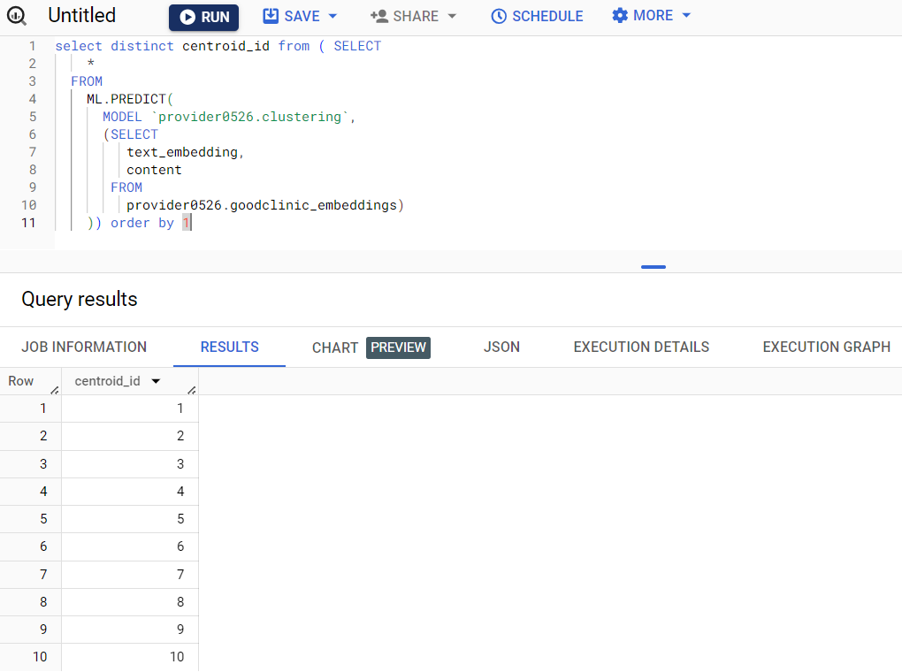
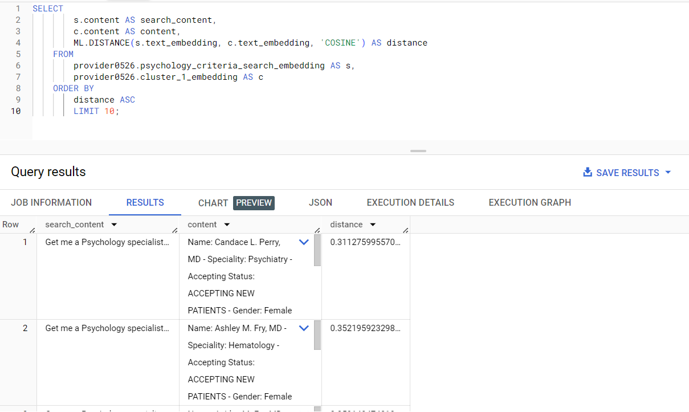

# Next step: make all tables for possible centroids

- Capture all centroids

```bash

select distinct centroid_id from ( SELECT
    *
  FROM
    ML.PREDICT(
      MODEL `provider0526.clustering`,
      (SELECT
         text_embedding,
         content
       FROM
         provider0526.goodclinic_embeddings) 
    )) order by 1

```

 

- Create cluster 2 for centroid 2 and like wise for all 10 centroids.

 ```bash
 
 CREATE OR REPLACE TABLE provider0526.cluster_2_embedding AS (
  SELECT
    *
  FROM
    ML.PREDICT(
      MODEL `provider0526.clustering`,
      (SELECT
         text_embedding,
         content
       FROM
         provider0526.goodclinic_embeddings)
    )
    WHERE centroid_id = 2
  );

 ```


# User search

 - A new search query from user: "Get me a Psychology specialist who speaks Spanish".

 ```bash
 
    CREATE OR REPLACE TABLE provider0526.psychology_criteria_search_embedding AS (
        SELECT
        *
        FROM
    ML.GENERATE_TEXT_EMBEDDING(
        MODEL `provider0526.embedding_model`,
            (SELECT
            "Get me a Psychology specialist who speaks Spanish" AS content),
            STRUCT(TRUE AS flatten_json_output))
    );
 ```

 - Search via K Means

  ```bash
    SELECT
        s.content AS search_content,
        c.content AS content,
        ML.DISTANCE(s.text_embedding, c.text_embedding, 'COSINE') AS distance
    FROM
        provider0526.psychology_criteria_search_embedding AS s,
        provider0526.cluster_1_embedding AS c
    ORDER BY
        distance ASC
        LIMIT 10;
  ```

  Search result found as below:

  


  **Note** - the user's search should be initiated in the centroid 1 for better result.
  If no result found, the centroid value needs to be increased until search result found.

  