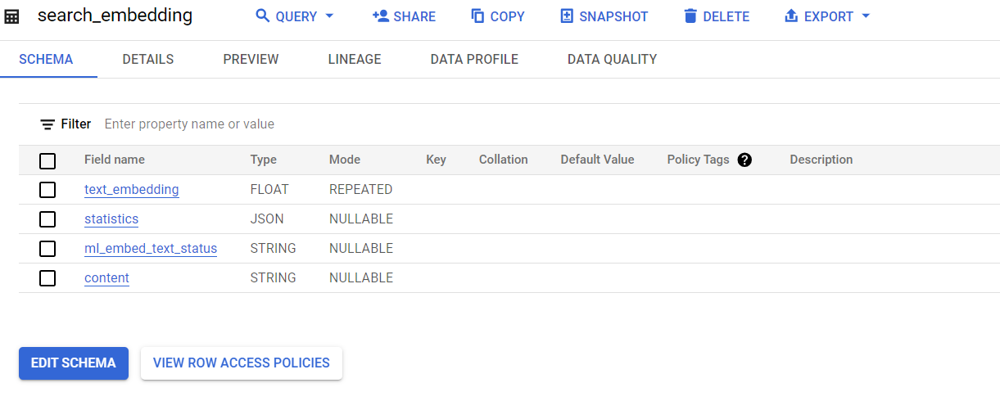
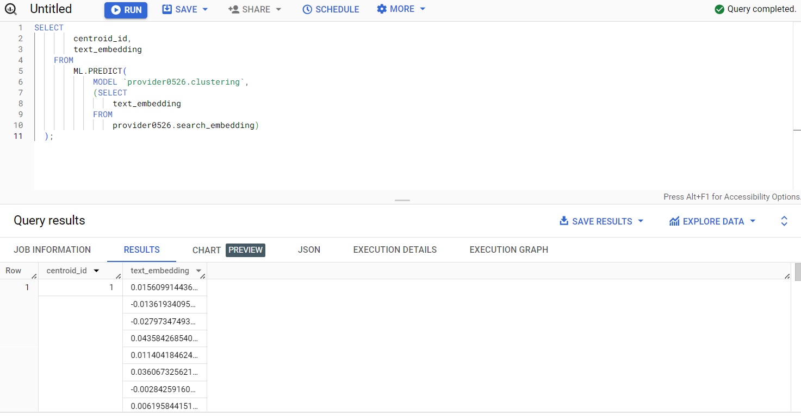
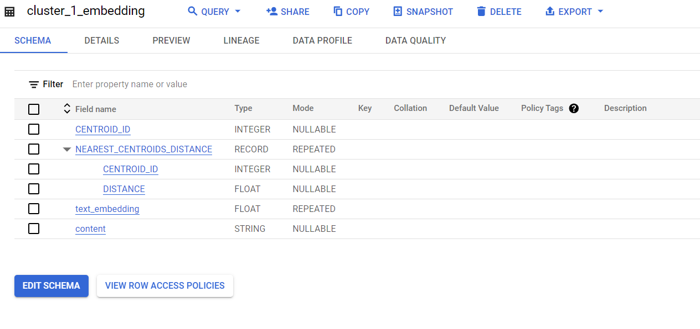
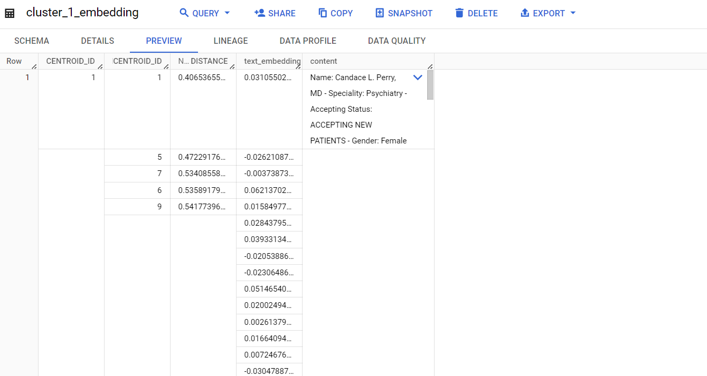
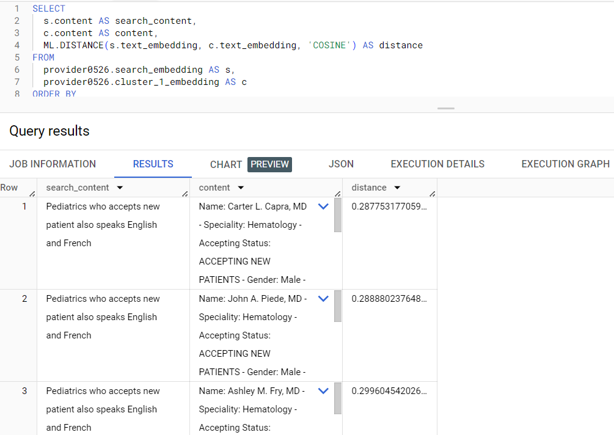

# Reference:

- https://cloud.google.com/bigquery/docs/text-embedding-semantic-search#gcloud

- https://cloud.google.com/bigquery/docs/reference/standard-sql/bigqueryml-syntax-generate-text-embedding

# Base table:

 - **Table name:** arindam-2banerjee-0525-pimy.provider0526.goodclinic

    **Schema**:

    ```bash
    #Schema:
        
    url	STRING	NULLABLE				
    name	STRING	NULLABLE				
    specialty	STRING	REPEATED				
    acceptingstatus	STRING	NULLABLE				
    gender	STRING	NULLABLE				
    language	STRING	NULLABLE				
    services	STRING	REPEATED				
    professional	STRING	REPEATED				
    fellowship	STRING	REPEATED				
    residency	STRING	REPEATED				
    affiliations	STRING	REPEATED				
    internship	STRING	REPEATED				
    certifications	STRING	REPEATED				
    address	STRING	NULLABLE				
    address_saddress	STRING	NULLABLE	
    ```

  **It has 5.5K rows with some columns as a repeated string.**

 - **Let's create a table with 100 rows only to have costs reduced.**

```bash
create or replace table `arindam-2banerjee-0525-pimy.provider0526.goodclinic_limited`
as 
select 'Name: '||name||' - Speciality: '||specialty||' - Accepting Status: '||acceptingstatus||' - Gender: '||gender||' - Language speaks: '||language ||' - Services: '||services||' - Residency: '||residency||' - Address: '||address||' - Reference link: '||url as details
from `arindam-2banerjee-0525-pimy.provider0526.goodclinic` ,  unnest(specialty) as specialty, unnest(services) as services, unnest(residency) as residency limit 100;
```

**Table name:** goodclinic_limited

**Schema:**

```bash
details	STRING	NULLABLE	
```


# Create a connection

 -  **Create a Cloud resource connection and get the connection's service account.**

 ```bash
 # Command:
 #bq mk --connection --location=REGION --project_id=PROJECT_ID \
 #   --connection_type=CLOUD_RESOURCE CONNECTION_ID

 bq mk --connection --location=us-central1 --project_id=arindam-2banerjee-0525-pimy \
    --connection_type=CLOUD_RESOURCE bq-embding-llm-connect 
 ```

 - **Retrieve and copy the service account ID because you need it in a later step:**

 ```bash
 # Command:
 # bq show --connection PROJECT_ID.REGION.CONNECTION_ID

 bq show --connection arindam-2banerjee-0525-pimy.us-central1.bq-embding-llm-connect
 ```

  

 - **Give your service account permission to use the connection: Vertex AI User and BigQuery Connection User**

 ```bash
    #gcloud projects add-iam-policy-binding 'PROJECT_NUMBER' --member='serviceAccount:MEMBER' --role='roles/serviceusage.serviceUsageConsumer' --condition=None

    #gcloud projects add-iam-policy-binding 'PROJECT_NUMBER' --member='serviceAccount:MEMBER' --role='roles/bigquery.connectionUser' --condition=None

    #gcloud projects add-iam-policy-binding 'PROJECT_NUMBER' --member='serviceAccount:MEMBER' --role='roles/aiplatform.user' --condition=None

    gcloud projects add-iam-policy-binding '12959087622' --member='serviceAccount:bqcx-12959087622-o5dc@gcp-sa-bigquery-condel.iam.gserviceaccount.com' --role='roles/serviceusage.serviceUsageConsumer' --condition=None

    gcloud projects add-iam-policy-binding '12959087622' --member='serviceAccount:bqcx-12959087622-o5dc@gcp-sa-bigquery-condel.iam.gserviceaccount.com' --role='roles/bigquery.connectionUser' --condition=None

    gcloud projects add-iam-policy-binding '12959087622' --member='serviceAccount:bqcx-12959087622-o5dc@gcp-sa-bigquery-condel.iam.gserviceaccount.com' --role='roles/aiplatform.user' --condition=None

 ```

 - **Create a model for specific Dataset.**

 **Here the dataset is:** provider0526

  ```bash
 # Command:
 # CREATE OR REPLACE MODEL `semantic_search_tutorial.embedding_model`
 #   REMOTE WITH CONNECTION `PROJECT_ID.REGION.CONNECTION_ID`
 #   OPTIONS (REMOTE_SERVICE_TYPE = 'CLOUD_AI_TEXT_EMBEDDING_MODEL_V1');


  CREATE OR REPLACE MODEL `provider0526.embedding_model`
    REMOTE WITH CONNECTION `arindam-2banerjee-0525-pimy.us-central1.bq-embding-llm-connect`
    OPTIONS (REMOTE_SERVICE_TYPE = 'CLOUD_AI_TEXT_EMBEDDING_MODEL_V1');

  ```
  
 - **Embed text**

 Create a new table that contains the text embedding of the good clinic data by using the **ML.GENERATE_TEXT_EMBEDDING** function:

 ```bash

    # Command
    # Reference: https://cloud.google.com/bigquery/docs/reference/standard-sql/bigqueryml-syntax-generate-text-embedding
    # CREATE OR REPLACE TABLE semantic_search_tutorial.wind_reports_embedding AS (
    # SELECT *
    # FROM
    # ML.GENERATE_TEXT_EMBEDDING(
    #     MODEL `bqml_tutorial.embedding_model`,
    #     (SELECT "Example text to embed" AS content),
    #     STRUCT(TRUE AS flatten_json_output)
    # );

    # New table created goodclinic_limited_embedding
    # with embeddings
    # from existing data from the table goodclinic_limited
    # by the model provider0526.embedding_model
    CREATE OR REPLACE TABLE `arindam-2banerjee-0525-pimy.provider0526.goodclinic_embeddings` AS (
    SELECT *
        FROM
        ML.GENERATE_TEXT_EMBEDDING(
            MODEL `arindam-2banerjee-0525-pimy.provider0526.embedding_model`,
                (select details as content from  provider0526.goodclinic_limited),
                STRUCT(TRUE AS flatten_json_output)
            )
    );
 ```
 
 **Query Checked**:

 
 
 **Table schema created from above embedding query**:
 
 
   
 **Data**:
 
 
 
 

- **Create a k-means model**:

 **Create a k-means model that clusters the wind reports text embeddings into 10 clusters:**

 ```bash
 # Command
 #CREATE OR REPLACE MODEL `semantic_search_tutorial.clustering`
 #   OPTIONS (
 #   model_type = 'KMEANS',
 #   KMEANS_INIT_METHOD = 'KMEANS++',
 #   num_clusters = 10) AS (
 #       SELECT
 #       text_embedding
 #       FROM
 #       semantic_search_tutorial.wind_reports_embedding
 #   );


    CREATE OR REPLACE MODEL `provider0526.clustering`
        OPTIONS (
        model_type = 'KMEANS',
        KMEANS_INIT_METHOD = 'KMEANS++',
        num_clusters = 10) AS (
            SELECT
                text_embedding
            FROM
                `arindam-2banerjee-0525-pimy.provider0526.goodclinic_embeddings`
        );
 ```

  


# Perform similarity search within clusters

 - Create a table with a single row that contains the search content and its text embedding:

 ```bash
 
 # Command:
 #CREATE OR REPLACE TABLE semantic_search_tutorial.search_embedding AS (
 #   SELECT
 #   *
 #   FROM
 #   ML.GENERATE_TEXT_EMBEDDING(
 #       MODEL `semantic_search_tutorial.embedding_model`,
 #       (SELECT
 #       "TREES DOWN NEAR THE INTERSECTION OF HIGHWAY" AS content),
 #       STRUCT(TRUE AS flatten_json_output))
 #   );

 CREATE OR REPLACE TABLE provider0526.search_embedding AS (
    SELECT
    *
    FROM
    ML.GENERATE_TEXT_EMBEDDING(
        MODEL `provider0526.embedding_model`,
        (SELECT
        "Pediatrics who accepts new patient also speaks English and French" AS content),
        STRUCT(TRUE AS flatten_json_output))
    );
 ```

 

 - Using the k-means model that you created, determine which cluster the embedded search content belongs to:

 ```bash
 
 SELECT
        centroid_id,
        text_embedding
    FROM
        ML.PREDICT(
            MODEL `provider0526.clustering`,
            (SELECT
                text_embedding
            FROM
                provider0526.search_embedding)
  );


 ```

 The result shows centroid 1.

 

 - In this case, the embedded search content is in the cluster with centroid_id equal to 1. Create a table that contains the content and text embeddings of comments in that cluster:

 ```bash

 CREATE OR REPLACE TABLE provider0526.cluster_1_embedding AS (
  SELECT
    *
  FROM
    ML.PREDICT(
      MODEL `provider0526.clustering`,
      (SELECT
         text_embedding,
         content
       FROM
         provider0526.goodclinic_embeddings)
    )
    WHERE centroid_id = 1
  );
 
 ```
  

  All cluster 1 values that belongs to centroid 1 available in this table, show below.

  

-  Use the ML.DISTANCE function to find semantically similar contents in the same cluster as the search content. Restricting to a single cluster speeds up the semantic search. To improve recall, you could include additional clusters in your search. The following query returns the top 10 contents from the goodclinic data that are most semantically similar to the text "Pediatrics who accepts new patient also speaks English and French":

```bash

    SELECT
        s.content AS search_content,
        c.content AS content,
        ML.DISTANCE(s.text_embedding, c.text_embedding, 'COSINE') AS distance
    FROM
        provider0526.search_embedding AS s,
        provider0526.cluster_1_embedding AS c
    ORDER BY
    distance ASC
    LIMIT 10;

```

 

